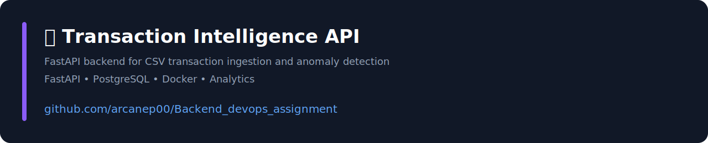
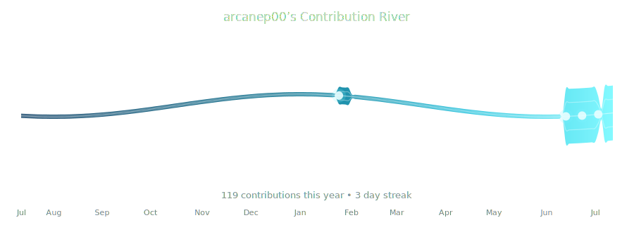
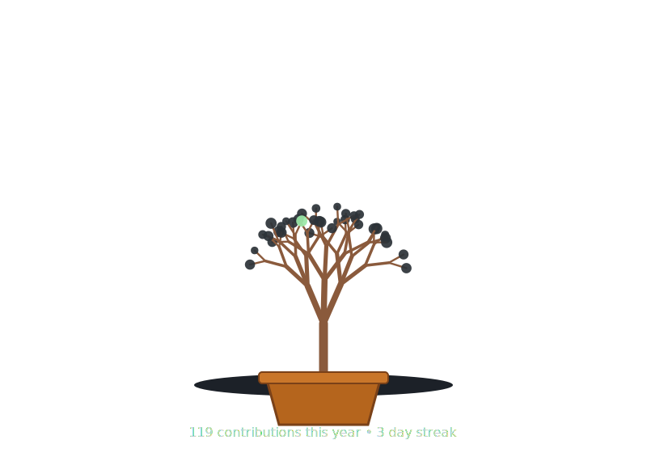
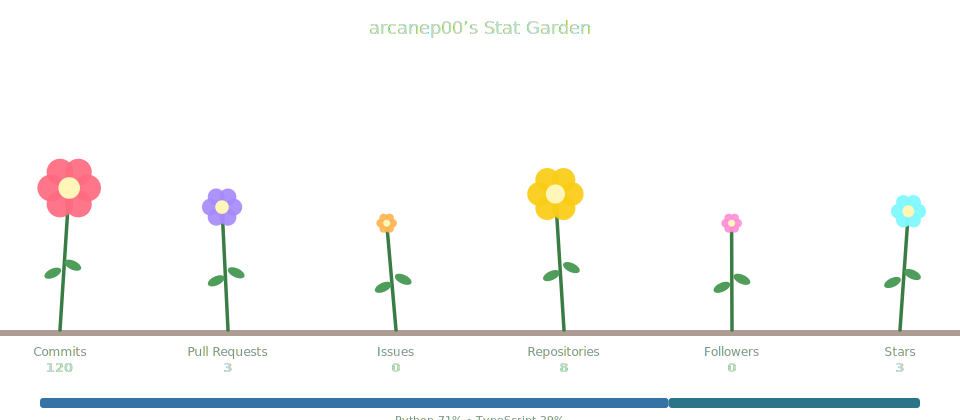

## 👨‍💻 About Me

- 💼 Software Intern @ Etelligens Technologies
- 🎓 B.Tech CSE (AI) | ABES Institute of Technology
- 🌱 Currently learning System Design, DevOps & Cloud
- 🚀 Passionate about scalable backend engineering
- 💬 Ask me about Python, Django, FastAPI, PostgreSQL

---

## 🛠 Tech Stack

### Languages

Python • Java • JavaScript • TypeScript

### Backend

Django • Django REST Framework • FastAPI

### Database

PostgreSQL • Redis

### Tools

Git • GitHub • Docker • Postman

---

# 🚀 Featured Projects

---

---

---

> 🌊 A flowing visualization of my GitHub activity over the past year. The river becomes wider and brighter as my contributions increase.
> 
### 🌊 My Contribution River

---

# 🏆 Highlights

- 💼 Software Intern @ Etelligens Technologies
- 🚀 Backend Engineer focused on scalable APIs
- ⚡ FastAPI • Django • PostgreSQL • Redis
- 🧠 Currently learning System Design & DevOps
- 🤖 Building AI-powered backend applications

---

# 🤝 Connect With Me

📧 **Email:** panabhi8456@gmail.com

💼 **LinkedIn:** https://linkedin.com/in/abhinav-pandey-115974379

💻 **GitHub:** https://github.com/arcanep00

🌐 **Portfolio:** https://my-portfolio-mu-amber-43.vercel.app/

---

Backend Engineer • Python • FastAPI • Django • PostgreSQL • System Design

---

## 🌳 My Contribution Bonsai

  <i>🌱 Growing with every commit.</i>

---

### 🌷 My Stat Garden

---

  <b>Thanks for visiting my profile! ⭐</b>  
  If you like my work, consider starring my repositories and connecting with me.

